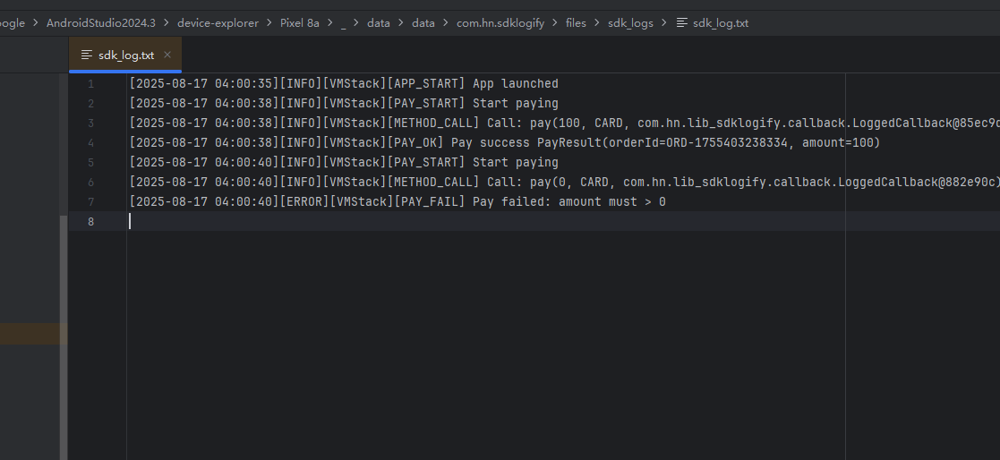

# 1. SDK Logify 📊

一个轻量级、可插拔、适用于 SDK 开发的日志收集工具。

<!-- Preview Images -->



---

## ✨ 特性

* ✅ 自动打印 SDK 中关键流程日志，例如鉴权、支付等
* ✅ 支持 SDK 开发者自定义 code/msg 类/枚举
* ✅ 不需要依赖 log.d()/print()，自动入手日志
* ✅ 支持接口方法代理，类的方法调用全进日志
* ✅ 全量级日志写入到 SDK 包名相关目录

## 1.0️ 安装（JitPack）

### 1.0.1 项目级仓库（`settings.gradle.kts` / `settings.gradle`）

**Kotlin DSL（settings.gradle.kts）**
```kotlin
dependencyResolutionManagement {
    repositoriesMode.set(RepositoriesMode.FAIL_ON_PROJECT_REPOS)
    repositories {
        google()
        mavenCentral()
        maven(url = "https://jitpack.io")
    }
}
dependencies {
    implementation("com.github.Gao-hao-nan:SDK-Logify:0.1.0")
}

```
---
## 1.1. 🚀 快速上手

### 1.1.1. 初始化 Logger

```kotlin
Logger.init(
    context = appContext,
    codeResolver = { (it as? MyCodeEnum)?.code.toString() },
    msgResolver = { (it as? MyMsgEnum)?.message ?: "unknown" }
)
```

### 1.1.2. 手动日志打印

```kotlin
Logger.autoReport(
    code = MyCodeEnum.INVALID_TOKEN,
    msg = MyMsgEnum.EXPIRED,
    data = mapOf("token" to "abc123"),
    level = LogLevel.ERROR
)
```

---

## 🧰 回调框架展示

### 自定义 SDK 回调

```kotlin
interface SdkCallback<T> {
    fun onSuccess(data: T)
    fun onError(code: Any, msg: Any)
}
```

### 打包日志回调 LoggedCallback

```kotlin
val wrapped = LoggedCallback(
    origin = originalCallback,
    onSuccessLog = { data -> "SUCCESS" to "操作成功: $data" },
    onErrorLog = { code, msg -> code to msg }
)

wrapped.onSuccess("user_abc")
wrapped.onError(401, "token 失效")
```

---

## 1.2. 🎩 接口方法全量跟踪

### 1.2.1. 方案：LogProxy.wrap

```kotlin
interface PaymentService {
    fun pay(amount: Int)
    fun refund(orderId: String)
}

val service = LogProxy.wrap(RealPaymentService())
service.pay(100)
```

运行效果：

```
[2025-07-28 14:33:01][DEBUG][PaymentService][METHOD_CALL] Call: pay(100)
```

---

## 📃 日志文件

所有日志会写入自定义目录：

```
<app>/files/sdk_logs/sdk_log.txt
```

包括时间、级别、条目、code、msg、附带数据

---

## 1.3. ✨ 推荐配置

* 将 `code`/“msg” 数据实现为 enum
* 在 SDK init 时候传入 `Logger.init()`
* 通过 `LogProxy.wrap` 对接口进行断言日志跟踪

---

